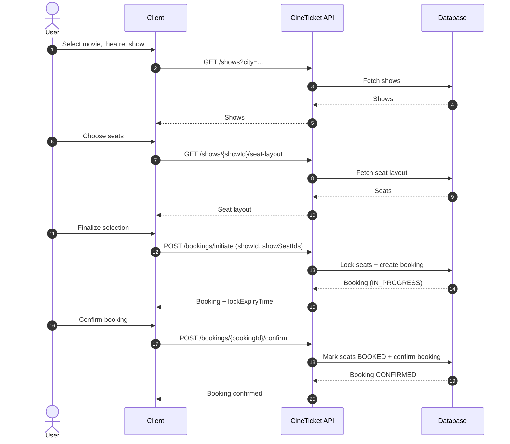

# 🎥 CineTicket — Movie Ticket Booking Microservices App

Welcome to **CineTicket** — a microservices‑based movie ticket booking backend built with Java and Spring Boot!  
Think of this as the core engine that could power a movie booking platform like BookMyShow, Fandango, or that kiosk next to the popcorn machine 🍿

---

## 🚀 What’s This?

**CineTicket** is a backend system for managing:

- 🎟️ User authentication (register & login)
- 🎬 Movie listings
- 🎭 Theatres & screens
- 🪑 Seats
- 🕰️ Show scheduling
- 🧾 Booking tickets

It’s designed as a structured set of Spring Boot modules that handle different parts of the movie booking domain.
---

## 🧠 Features (aka “Why it’s cool!”)

- 💡 User authentication with JWT
- 📊 Admin & public APIs for movies
- 🏛️ Theatre, screen, seat management
- ⏰ Show scheduling and management
- 🎫 Booking service with full create/read functionality
- 📦 Clean layered architecture (controllers → services → repositories)

---

## 🧩 Repo Structure

Here’s a quick look at how things are organized:
src/main/java/com/cineticket/
├── auth/ # Authentication (register/login)
├── movie/ # Manage movie data
├── theatre/ # Theatres + screens + seats
├── show/ # Showtimes
├── booking/ # Seat bookings

Each module uses Entities, Repositories, DTOs, Services, Controllers — the classic Spring Boot MVC pattern.

---

## 🛠️ Tech Stack

- 🧪 Java 17
- 🌱 Spring Boot
- 📡 Spring Security (JWT)
- 🗄️ JPA + any SQL database
- 🛠️ Gradle build system

---

## Postman Run Order

Run the collection in this order (top to bottom), and make sure the app is running:

1. `GET /health` (sanity check)
2. `Auth - Register User`
3. `Auth - Login User`
4. `Auth - Login Admin`
5. Admin setup requests (movie → theatre → screen → show)
6. User flow (shows → layout → booking → payment → confirm)

---

## Sequence Diagram

