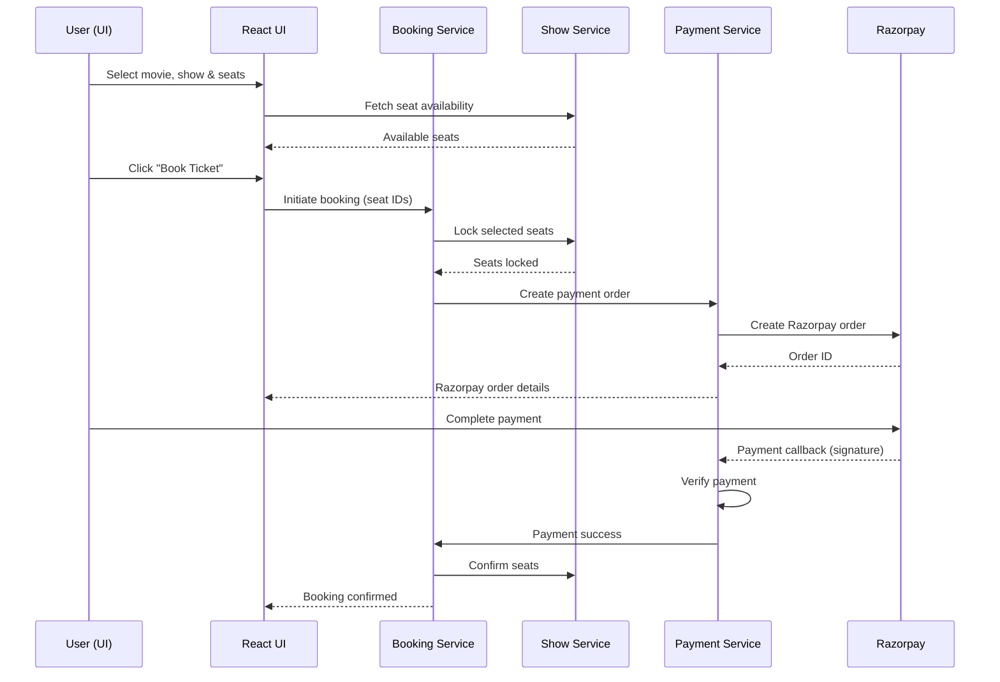
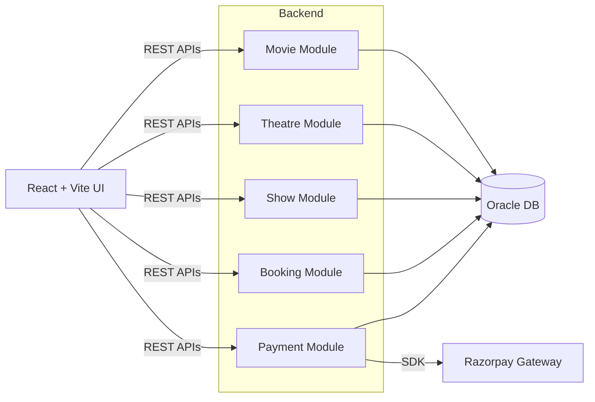

# 🎬 CineTicket – Movie Ticket Booking System

CineTicket is a **BookMyShow‑like movie ticket booking platform** built with **Spring Boot (Microservices) + Oracle DB + React (Vite)**.
The project focuses on **real‑world backend architecture**, payment integration, seat‑locking, and scalability.

---

## 🚀 Features

### 🎥 Movie & Theatre Browsing

* View **unique movies** in the Movies tab
* View **theatre‑wise movies & shows** in the Theatres tab
* Support for multiple shows per movie per theatre

### 🎟 Seat Booking System

* Real‑time seat availability
* **Seat locking** to prevent double booking
* Booking lifecycle management (INITIATED → CONFIRMED → CANCELLED)

### 💳 Payment Integration

* **Razorpay Payment Gateway** integration
* Order creation & payment verification
* Booking confirmation only after successful payment
* Handles page refresh during payment flow

## 🛠 Tech Stack

### Backend

* Java 17+
* Spring Boot 3
* Spring Data JPA
* Spring Security
* Oracle Database
* Razorpay SDK

### Frontend

* React
* Vite
* Axios

---

## 🏗 Project Architecture

```
CineTicket
│
├── movie-service
├── theatre-service
├── show-service
├── booking-service
├── payment-service
└── api-gateway (planned)
```
---

## 💳 Payment Flow (Razorpay)

1. User selects seats
2. Backend locks seats
3. Razorpay Order is created
4. User completes payment
5. Payment signature is verified
6. Booking is confirmed

---

## 📐 System Diagrams

### 🔁 Booking & Payment Sequence Diagram



---

### 🏗 High-Level Architecture Diagram



---

## ▶️ Running the Project

### Backend

```bash
./gradlew bootRun
```

### Frontend

```bash
npm install
npm run dev
```


## 📌 Future Enhancements

* API Gateway
* Redis caching
* Movie poster CDN & preloading
* Distributed seat locking
* Production deployment (Docker + Cloud)

---

## 👨‍💻 Author

**Sameep Hedaoo**
Software Engineer | Java | Spring Boot | Microservices

---

> This project is built with a strong focus on **real‑world system design**, not just CRUD APIs.
